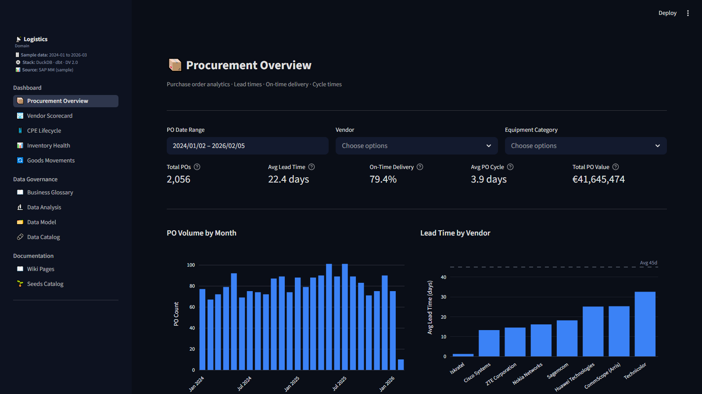
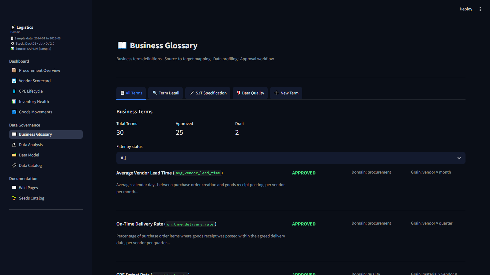

# DG AI Agent — it learns a source system and writes the source-to-target mappings

[](https://github.com/mmarkac1905/DG-Agent/actions/workflows/ci.yml)


*The Streamlit app on the generated data: procurement KPIs on the left-nav Dashboard pages, the
governance layer (glossary, S2T, catalog, lineage) under Data Governance.*

**Give it a business-term definition. It learns the source system from the actual data — profiles every
table, measures how tables *really* join — then generates the source-to-target mapping and the
transformation SQL, verified and deployed.** A business metric goes from a one-line definition to a
tested data mart with no human writing SQL. Demonstrated end-to-end on **two source systems**: a
synthetic SAP MM system, and the public Olist e-commerce dataset — real data this repo's authors did
not generate, where the pipeline discovered the join graph blind and side-stepped a semantic trap that
silently yields a 100%-wrong metric (see [Pointing it at another source](#pointing-it-at-another-source)).

That generation step is the part the catalog tools don't do. Informatica and Collibra do harvest schemas
and trace lineage — but a person still writes the S2T mapping in a spreadsheet and hand-codes the
transformation SQL. **They don't *generate* the mapping or the SQL.** DG AI Agent does, end to end, with
every step checked by deterministic gates.

> **Stack:** DuckDB · dbt · Streamlit · Claude (Anthropic API) · Python
> **License:** MIT · **Status:** working MVP — primary demo on 100% synthetic data, second source on real public data
> **Source systems:** SAP MM — *Customer Premises Equipment (CPE)* procure-to-deploy for a fictional
> operator, **Helios Telecom** (synthetic, primary demo) · **Olist** Brazilian e-commerce
> (real public dataset, opt-in second source).

> ⚡ **"Where's the data?"** There's no database in this repo — *by design*. The repo ships the
> **generators**, not a 250 MB binary. One command — `python scripts/bootstrap.py` — fabricates the
> synthetic SAP source system (deterministic, so everyone gets the identical dataset) and builds every
> layer locally. Nothing to download. See **[Quickstart](#quickstart)**.

---

## What's actually new here

Most "data governance" tooling — and most "AI + data" demos — stop at *cataloging* metadata or *chatting
about* data. The hard, unsolved part is **turning intent into a correct, deployable transformation**:
which source tables, how they join, whether the data even supports the metric, and what SQL computes it.
That requires **learning the source system from its data**, not just storing metadata about it.

| | Informatica / Collibra (catalog tools) | **DG AI Agent** |
|---|---|---|
| Inventory the source | schema-level metadata scanners | **value-level profiling from the live data** (nulls, codes, magnitudes) |
| Discover joins · PK/FK · cardinality | declared/hand-documented relationships | **empirically measured from the data (EDA)** — incl. fanout risk |
| Source→target mapping | hand-written in Excel / a mapping UI | **LLM-generated, evidence-cited** |
| Transformation SQL | hand-coded by an engineer | **generated and build-tested** |
| Verify it's correct | manual review | **deterministic gates + `dbt test`** |

It *also* keeps the governance layer (glossary, catalog, lineage) as plain text in git instead of a vendor
SaaS — but that's the means, not the headline. The headline is **automatic source-system learning →
verified S2T mapping generation**.

---

## How it learns a source and builds the mapping — 7 stages

A business term becomes a materialized, grain-validated dbt mart through staged LLM reasoning where **the
LLM proposes and deterministic checks verify** at every step. Stages A–C′ are the *learning*; D–E are the
*generation + proof*:

| Stage | What happens | LLM? | Guardrail |
|---|---|---|---|
| **0 · Spec** | human writes the term: definition, grain, unit, filter | no | the contract every later stage validates against |
| **A · Scope** | LLM reads the catalog and picks the minimal source tables | yes | tables checked against the live DB; joins checked vs **cardinality evidence** |
| **B · Blockers** | gaps it finds become routed blockers (`→ C / C′ / human`) | — | deterministic triage |
| **C · Domain EDA** | **learns each table from its data** — completeness, magnitude, codes, PK/FK, grain | mixed | LLM writes the SQL, **DuckDB executes it** |
| **C′ · Term EDA** | validates *the term's own logic* across tables (8-lens agent loop) | yes | each blocker resolved only on concrete evidence |
| **D · Generation** | LLM **writes the S2T mapping + dbt SQL**, citing the EDA evidence join-by-join | yes | layer + column pre-flights → **reject + repair-retry**; self-attestation audit |
| **E · Deploy** | `dbt run` / `dbt test` + semantic validator (grain · filter · unit) | no | the hard backstop — invalid SQL physically cannot materialize |

The principle, enforced in code: **ground it, verify it, never trust it.** The LLM is grounded with the
real schema *learned in C/C′*, its output is checked against ground truth by deterministic pre-flights,
and `dbt build` refuses anything that wouldn't run — so the LLM's judgment is *useful* without being
*trusted*.

> **Worked example** (it lives in the repo). Define *"CPE contribution margin per service plan × tenure
> band, per month."* The pipeline learns a 14-table scope, profiles the real data, validates the term's
> logic, then generates a **vault-based dbt fact + a dashboard view** — which deploys grain-clean and
> reconciles billed revenue **to the euro**. Every decision, the EDA evidence, and the generated SQL are
> recorded back into the knowledge graph, so the *reasoning* is version-controlled too.

---

## The EDA framework — how it actually *learns* a source

The "learning" in stages C / C′ is two passes of structured exploratory data analysis. Together they turn
a pile of opaque SAP tables into the **evidence** the generator needs to write a *correct* mapping — so by
the time any SQL is written, the LLM is reasoning about *this* source system's measured shape, not an
abstract schema.

### Pass 1 — Domain EDA: profile each table on its own

A suite of analyzers runs per source table. Four are **LLM-assisted** (the LLM writes the profiling SQL,
DuckDB executes it, the LLM interprets the result); four are **deterministic** (pure SQL). Each answers
one question the mapping will depend on:

| Analyzer | What it measures | Why the mapping needs it |
|---|---|---|
| **completeness** | null rate per column | a measure that's 40% null needs `COALESCE`/a filter — or isn't usable |
| **dimensions** | distinct values / cardinality per column | finds the grouping axes and which columns are codes |
| **magnitude** | scale of each measure (sum, by dimension) | sanity scale + a reconciliation anchor (does it total what it should?) |
| **code_tables** | decode coded columns by **joining a decoder** (never a hallucinated `CASE`) | turns `BWART=101` / `MTART=CPE` into the meaning the filter logic needs |
| **date** | temporal span, gaps, granularity | confirms a `month` grain is even possible; finds missing periods |
| **segmentation** | value thresholds (quartiles) | banding for bucketed metrics |
| **schema_discovery** | PK / FK candidates + referential-integrity % | **discovers how the tables join** — the backbone of any S2T |
| **grain_relationship** | fanout class per table pair (`per_record_key` / `header_detail` / `catastrophic_fanout`) | tells the generator which joins are **safe** vs which would silently multiply rows and corrupt every aggregate |

The last two are the crux: the system **learns the join graph empirically** — from referential integrity
and cardinality in the *actual data*, not a hand-drawn ER diagram. That's how it avoids the classic
failure where a mapping joins two tables and silently 10×'s the revenue.

### Pass 2 — Term EDA: validate *this metric's* logic

Domain EDA learns the tables; Term EDA learns whether **your specific term** survives contact with the
data. It's a multi-turn agent that considers an 8-lens analytical framework and emits only the queries
that apply:

| Lens | Question it asks of the term |
|---|---|
| `measures_overview` | what are the headline totals / counts? |
| `by_dimension` | does the measure split cleanly by the chosen dimension? |
| `ranking` | top / bottom — any outliers that break the logic? |
| `time_trend` | does it behave sensibly over the date grain? |
| `cumulative` | do running totals make sense? |
| `variance` | actual vs target / prior — is the comparison meaningful? |
| `bucketing` | do the `CASE WHEN` bands populate? |
| `part_to_whole` | do the shares sum to 100%? |

It runs in three phases: **(1) framework floor** — consider all 8 lenses, pick or skip each *with a
reason*; **(2) reflection** — find the single biggest remaining gap and probe it; **(3) sufficiency
loop** — keep going until the evidence is enough to author a confident mapping, then stop. Every result
is recorded, so Stage D cites *real numbers* ("revenue sums to X; this join is 1:1") instead of guessing.

**Net effect:** when the LLM finally writes the S2T mapping and SQL, it already knows which columns are
populated, what the codes mean, how the tables genuinely join, and whether the metric holds up — because
it *measured* all of it first.

---

## Architecture

```
Layer 0  RAW        source tables generated into DuckDB (synthetic SAP sample data)
Layer 1  STAGING    dbt views — clean / rename / type-cast SAP fields to business names
Layer 2  VAULT      dbt incremental — Data Vault 2.0 (hubs, links, satellites)
Layer 3  MARTS      dbt tables — Kimball star schema (dims, facts)
Layer 4  OBT        dbt views — flattened wide tables for BI
Layer 5  KNOWLEDGE  dbt views — computed business facts, KPIs, health checks
Layer 6  STREAMLIT  dashboard + governance UI reading from OBT / knowledge
```

**The knowledge graph lives in `dbt/seeds/`** — both the governance content (`business_glossary`,
`s2t_mapping`, `sap_data_dictionary`, `data_vault_design`, …) and what the pipeline *learns* (per-table
analysis results, join/cardinality findings, semantic models). The wiki under `knowledge/` is generated
from these seeds; the source of truth is always the seeds + DuckDB.


*The Business Glossary UI: term definitions with grain + approval status, and the tabs where a term goes
from definition → analysis → S2T specification → deploy.*

---

## Quickstart

```bash
# 1. clone + environment
git clone <your-fork-url> dg-ai-agent && cd dg-ai-agent
python -m venv .venv && source .venv/bin/activate    # Windows: .venv\Scripts\activate
pip install -r requirements.txt

# 2. (optional) LLM key — only needed to RUN the AI pipeline, not to build the data
cp .env.example .env        # then edit .env and set ANTHROPIC_API_KEY

# 3. build everything from scratch — generates the synthetic source system + all dbt layers
python scripts/bootstrap.py

# 4. launch the app
streamlit run app/Home.py
```

After step 3 you have a fully populated `cpe_analytics.duckdb` (~200 MB) and **135 dbt models** across
every layer — ready to query, dashboard, and run the AI pipeline against.

<details><summary><b>What <code>bootstrap.py</code> runs</b> (the same steps, by hand)</summary>

```bash
python scripts/generate_sap_sample_data.py   # MM:  PO, GR, inventory, equipment
python scripts/generate_zmm_approval_log.py  # ZMM: custom approval-log Z-table
python scripts/generate_sd_billing.py        # SD:  customers, sales orders, billing
python scripts/generate_fi_shadows.py        # FI:  accounting-document shadows
cd dbt && dbt deps && dbt seed && dbt run && dbt test   # build all layers (run FROM dbt/ — relative DuckDB path)
```
</details>

### Where the data comes from (no database is committed)

The repo ships **the data *generators*, the dbt models (DDL-as-code), and the seed knowledge graph** —
never the database, which is a build artifact (git-ignored). The generators are **deterministic**
(`seed=42`), so every clone produces the byte-identical source system; `dbt run` then recreates all 135
models. Think of the repo as the **recipe**, not the cooked meal — `bootstrap.py` cooks it locally. (The
generated **governance wiki under `knowledge/` *is* committed**, so you can browse the glossary, catalog,
and S2T mappings on GitHub without building anything.)

---

## Repository structure

```
app/            Streamlit UI + claude_api.py — the LLM pipeline (scope · EDA · S2T generation)
dbt/
  models/       staging / vault / marts / obt / knowledge  (the 6 data layers)
  seeds/        the knowledge graph — governance content + what the pipeline learns
scripts/        data generators, EDA analyzers, S2T pipeline runners, wiki builder, bootstrap.py
  prompts/      LLM prompt templates — one per pipeline stage/analyzer, loaded at runtime
knowledge/      generated governance wiki — committed so it's browsable on GitHub
tests/          pytest suite + fixtures
CLAUDE.md       agent & contributor guide (conventions for working in the repo)
```

---

## Vocabulary (acronyms you'll meet in the code)

| Term | Meaning |
|---|---|
| **S2T** | source-to-target mapping — which source columns feed which target columns, and how |
| **DAR** | domain analysis result — one EDA finding about a source table (seed: `domain_analysis_results`) |
| **TAR** | term analysis result — one EDA finding scoped to a specific business term (`term_analysis_results`) |
| **BAR** | business-term analysis result — one full run of the multi-turn term-analysis loop, with its evidence, convergence status, and token cost (`business_term_analysis_results`) |
| **Layer A / Layer B** | SQL-writing conventions per source table: Layer B is compiled deterministically from dbt's manifest (dbt-covered tables); Layer A is LLM-synthesized from EDA for raw-only tables |
| **Stage 0–E** | the pipeline: spec → A scope → B blockers → C domain EDA → C′ term EDA → D generation → E deploy |
| **F.3** | the post-generation join validator — rejects SQL whose joins the cardinality evidence classifies as `catastrophic_fanout` |
| **Grain** | the row-level unit a metric is measured at (e.g. *vendor × month*) — validated at deploy |

## Pointing it at another source

The pipeline is **source-agnostic by configuration**. To prove it — and to answer the fair criticism
that a system validated only on data its own author generated proves the *mechanism* but not
*robustness* — we pointed it at the public
[Olist Brazilian e-commerce dataset](https://www.kaggle.com/datasets/olistbr/brazilian-ecommerce):
9 tables, ~100k real orders (2016–2018), loaded as-is with all its real-world dirt (duplicate review
ids, multiple payment rows per order, a geolocation table that fans out ×1,100 per zip prefix, and an
order-scoped customer key).

### What happened

Two business terms went from a one-line definition to deployed, tested dbt marts, for **~$3 total in
LLM cost**, with every number below independently re-verified by hand-written SQL:

| Term | What the pipeline did | Result |
|---|---|---|
| **Monthly GMV by category** | Scoped 4 of 9 tables, learned the join graph blind from the data, generated a full greenfield chain (4 staging → 6 vault → mart → OBT), joins written in the fanout-safe direction *citing the cardinality evidence by id* | Deployed mart reconciles **to the cent**: 13,496,408.43 BRL across 1,282 category-months |
| **Repeat customer rate** | The trap term: Olist's `customer_id` is unique *per order*, so the obvious key yields a repeat rate of **0.0%** — plausible-looking, silently 100% wrong. The pipeline's scope stage identified `customer_unique_id` as the required person key from the profiled evidence and built on it | Deployed mart computes the correct **~3.0%**; the semantic validator flagged two genuine edge-case warnings for analyst review |

The experiment also did what a second source should do: it **broke things, and the breaks became
fixes** — direction-aware join-fanout evidence, source-neutral repair hints, schema grounding for
cross-mart refs, and a greenfield path so a brand-new source can have its staging → vault → mart
chain proposed in one generation pass. The still-open gaps are recorded honestly in
`known_issues` (#131–134). Every step of the run — evidence, costs, decisions — is in the
seeds/knowledge graph like any other run.

### The recipe

1. **Load** the source's tables into a new DuckDB schema (e.g. `raw_olist`) in `cpe_analytics.duckdb`.
2. **Document** them: add per-column rows to `sap_data_dictionary.csv` (see
   `scripts/generate_olist_data_dictionary.py` as a template — types from `information_schema`,
   descriptions from the source's docs) and `dbt seed`.
3. **Point the pipeline**: `DG_SOURCE_SCHEMA=raw_olist` (every analyzer and stage reads it), plus
   optional `DG_DOMAIN_CONTEXT="a Brazilian e-commerce order-to-delivery data product"` for prompt
   framing and `DG_AGENT_MODEL` to switch models.
4. **Learn it**: run the deterministic analyzers (`run_schema_discovery_analysis`,
   `run_join_cardinality_analysis`, `run_date_analysis`, `run_segmentation_analysis`) per table —
   free, no LLM — then the LLM analyzers (`run_completeness/dimensions/magnitude/code_tables_analysis`)
   for the tables your terms need.
5. **Define terms** in `business_glossary.csv` (status `draft`) and run the stages: scope → term
   EDA → S2T → deploy. New sources get their staging + vault + mart chain proposed automatically.

The Olist example is opt-in: its 16 generated dbt models live under `dbt/models/olist/` behind
`DG_ENABLE_OLIST=true`, so the default SAP build is untouched.

## Honest limitations

Read this before extrapolating from the demo:

- **Two sources; the primary one is synthetic.** The SAP demo's *schema* is real (scraped from public
  SAP references via `scripts/scrape_sap_catalog.py`) but its *rows* are generated. The EDA runs blind
  (the LLM only ever sees live query results — never the generator code), so the join graph really is
  *discovered*, not leaked. The second source (Olist, see above) is real public data with real dirt —
  duplicate reviews, multi-row payments, an order-scoped customer key — and the pipeline handled it,
  including choosing the correct person identifier where the naive key yields a 0% repeat rate.
- **Sources are selected per run, not federated.** `DG_SOURCE_SCHEMA` points the whole pipeline at one
  source at a time. A consolidated multi-source catalog (source_system as a first-class column, terms
  scoped across the union of sources) is the designed next step, not the current state.
- **N = 3 worked terms, no systematic eval.** BG030 (SAP) plus BG031/BG033 (Olist) are fully worked
  end-to-end. There is no success-rate eval across dozens of term definitions yet. Every run records
  its evidence, convergence status, and cost into the seeds, so the substrate for that eval exists.
- **Token cost.** Recorded term-analysis runs in the shipped seeds cost **$0.08–$0.74 each**
  (`business_term_analysis_results.llm_total_cost_usd`); a full Stage A→E pass makes several LLM calls —
  budget a few dollars per term.

## Data & disclaimer

All data is **synthetic**, produced by the generators in `scripts/`. **Helios Telecom** is a **fictional**
operator; the org structure, ABAP catalog, and SAP customizations are illustrative examples of *typical*
telco patterns — not any real company's system, and nothing proprietary. Vendor names (Huawei, ZTE,
Nokia, …) are real CPE manufacturers used for realism, but **every figure, event, and quality record
attributed to them is invented**.

The AI pipeline calls the Anthropic API and **incurs token cost on your own key**. The repo never
contains a key — `.env` is git-ignored; copy `.env.example` to start.

---

## License

MIT — see [LICENSE](LICENSE).
